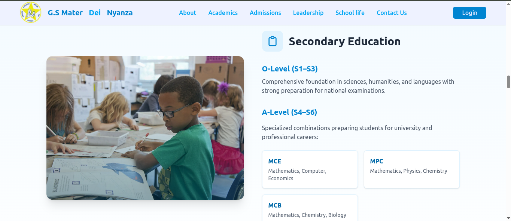
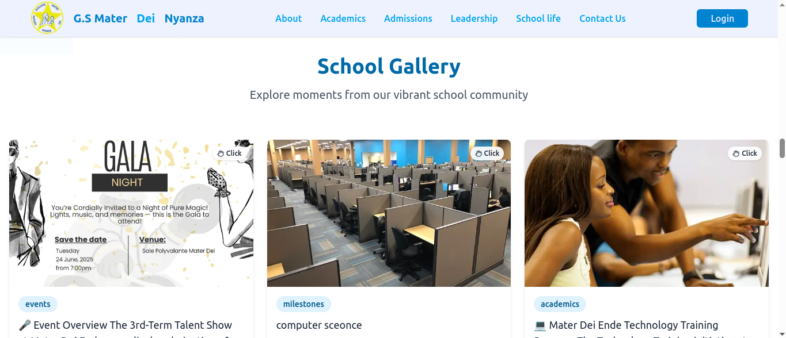
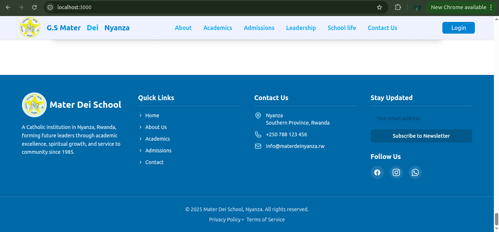

This is a [Next.js](https://nextjs.org) project bootstrapped with [`create-next-app`](https://nextjs.org/docs/app/api-reference/cli/create-next-app).

First, run the development server:

```bash
npm run dev
# or
yarn dev
# or
pnpm dev
# or
bun dev
```

Open [http://localhost:3000](http://localhost:3000) with your browser to see the result.

You can start editing the page by modifying `app/page.tsx`. The page auto-updates as you edit the file.

This project uses [`next/font`](https://nextjs.org/docs/app/building-your-application/optimizing/fonts) to automatically optimize and load [Geist](https://vercel.com/font), a new font family for Vercel.

## Learn More

To learn more about Next.js, take a look at the following resources:

- [Next.js Documentation](https://nextjs.org/docs) - learn about Next.js features and API.
- [Learn Next.js](https://nextjs.org/learn) - an interactive Next.js tutorial.

You can check out [the Next.js GitHub repository](https://github.com/vercel/next.js) - your feedback and contributions are welcome!

## Deploy on Vercel

The easiest way to deploy your Next.js app is to use the [Vercel Platform](https://vercel.com/new?utm_medium=default-template&filter=next.js&utm_source=create-next-app&utm_campaign=create-next-app-readme) from the creators of Next.js.

Check out our [Next.js deployment documentation](https://nextjs.org/docs/app/building-your-application/deploying) for more details.

## Mater Dei School Website

A modern website for Mater Dei School built with Next.js

## Table of Contents

About

Features

Getting Started

Project Structure

Technologies Used

Screenshots

Deployment

Contributing

License

## About

This website connects students, parents, and staff through dynamic content — news, announcements, events, and resources — managed easily through Sanity CMS.

## Features

Dynamic content powered by Sanity CMS

Animated UI with Framer Motion

Full-screen background image slider hero

Responsive design with Tailwind CSS

SEO optimized with Next.js

Easy updates without code changes

## Getting Started

Prerequisites
Node.js (v16+)

npm / yarn / pnpm / bun

Installation
bash
Copy
Edit
git clone https://github.com/yourusername/materdei-website.git
cd materdei-website
npm install
npm run dev
Open http://localhost:3000 in your browser.

## Project Structure

bash
Copy
Edit
app/ # Main Next.js app components and pages
components/ # Reusable UI components (Hero, Leadership, News)
lib/ # Sanity client and utilities
public/assets/ # Images, logos, and avatars
styles/ # Tailwind and global styles
Technologies Used
Technology Description
Next.js – React framework for production
Sanity CMS – Content management platform
Framer Motion – Animation for React
Tailwind CSS – Utility-first CSS
TypeScript – Type-safe JavaScript







